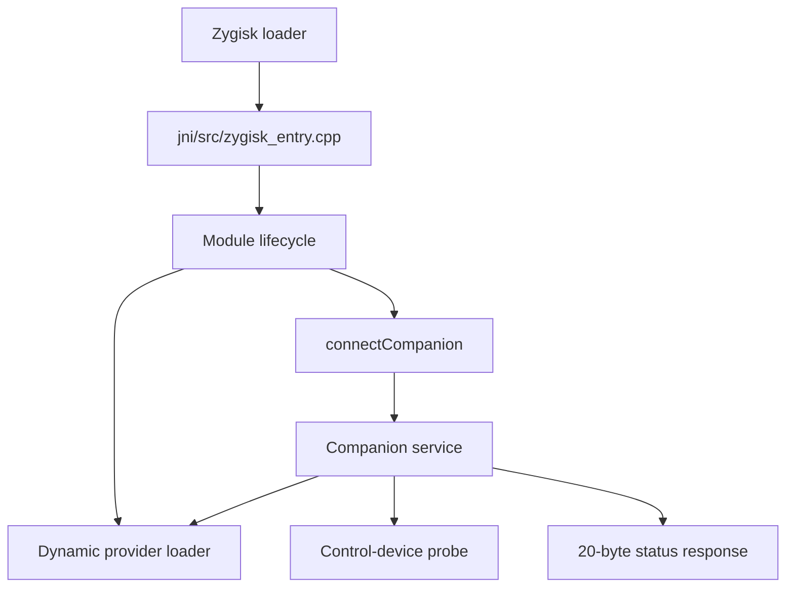

# Architecture

## Runtime flow

1. Zygisk calls `zygisk_module_entry`, registered with `reconstructed::Module`.
2. `Module::onLoad` records the Zygisk API and JNI environment, then attempts
   the dynamically resolved hook provider.
3. App and server pre-specialization callbacks record the process name when it
   is available and request the companion service.
4. The companion handler increments its request counter, repeats the provider
   resolution boundary, probes the control device, and returns `StatusPacket`.
5. The service drains the request socket and closes the client connection.

## Boundaries preserved from analysis

| Recovered behavior | Project location |
| --- | --- |
| Module entry at raw `0x2960a0` | `jni/src/zygisk_entry.cpp` |
| Companion entry at raw `0x299450` | `jni/src/zygisk_entry.cpp` |
| Dynamic library and two symbol candidates | `jni/src/external_provider.cpp` |
| Control path, ioctl, and 0x100-byte request area | `jni/src/control_device.cpp` |
| 20-byte companion packet | `jni/include/wire_protocol.hpp` |
| Process lifecycle callbacks | `jni/src/module_runtime.cpp` |

The raw address-to-function inventory is in `../source_index.csv`; the full
Ghidra source view is in `../c/recovered_functions.c` and the exact-instruction
fallback is in `../assembly/recovered_fallback.s`.
